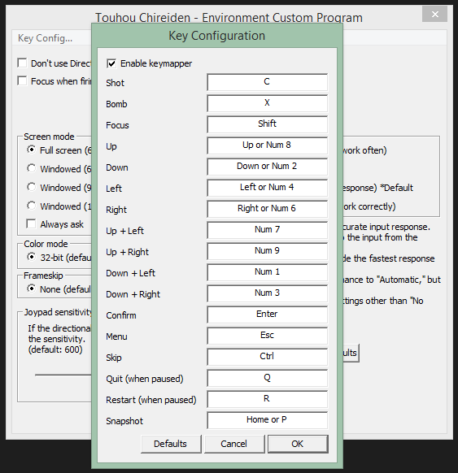

# TouhouKeymap

This is a plugin for the Touhou Community Reliant Automatic Patcher which adds configurable keyboard controls to all supported games. Currently, this includes all games supported by thcrap except for Twilight Frontier games.

To use, simply put `TouhouKeymap.dll` in thcrap's `bin` directory, and then each game's setup program will have an added "Key Config" menu item allowing you to set up custom keyboard settings for each game. For games which allow you to select a screen resolution on startup, the Key Config option is also available via that dialog.

Key settings are saved as `TouhouKeymap.ini` in each individual game's directory, so you can also copy and paste an existing keyboard configuration from one game to another.

### Features

* Integrates directly with the game / patcher, no additional software needed
* Works both with or without DirectInput enabled
* Separate configuration for each game, including any game-specific keys (e.g. specific support for games with a third action button, or games like StB which have non-standard controls)

### Currently not supported

* All Twilight Frontier games. It's possible to support these later, but there needs to be a good way to inject the "Key Config" GUI into games that don't have a separate setup program.
* 2P left/right controls for PoFV. If you're going to use these for a local multiplayer game, it's recommended to leave custom keys disabled for now.

### Download

The current version of the plugin is available from the "Releases" section of this GitHub repo.
